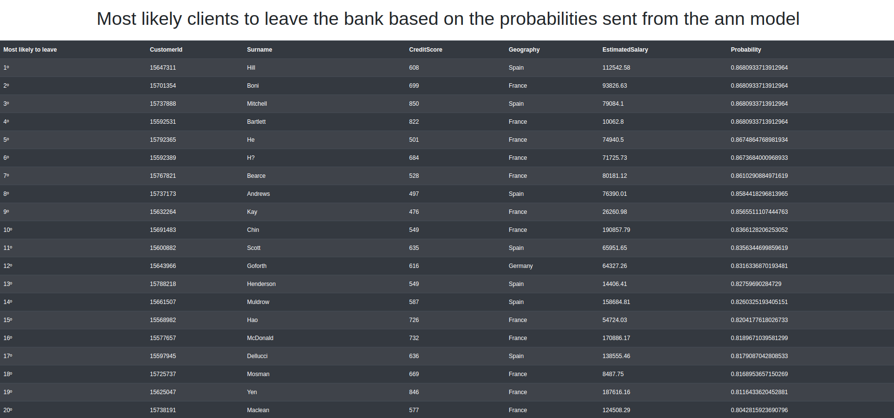

# Investigação dos clientes mais propensos a deixarem determinado Banco

  
## Descrição do projeto

* Tipo do problema: Ordenação de Probabilidade

* Um banco quer investigar o motivo da perda de alguns clientes e ter uma predição dos clientes atuais. Para isso, separou um dataset com 10000 mil amostras dos últimos 6 meses com clientes que deixaram e que ainda são clientes do Banco. 

* Missão: Com uma função logística no último layer de uma ann, será retornado a probabilidade dos clientes atuais deixarem o banco e depois, uma tabela com os clientes remanescentes mais propensos a deixarem o banco serão usadas para visualização.

## Guia de instalação
### Execute com virtualenv
* Crie um arquivo virtualenv: `virtualenv -p python3 env`
* Ative com: `source env/bin/activate`
* Instale os requirimentos: `pip install -r requirements.txt`
* Execute o servidor com: `python3 app.py`
* Acesse: `localhost:5000` no browser

### Execute com Docker
* Baixe o docker-compose: `sudo apt install docker-compose`
* Execute: `sudo docker-compose up --build`
* Acesse: `localhost:5000` no browser

## Capturas de tela
 

## Conclusões
Com a exibição dos clientes mais propensos a se deixarem o banco, torna-se mais claro os clientes o qual o banco deve investigar a situação e descobrir eventuais problemas para atenuar o número de clientes que querem evadir.

